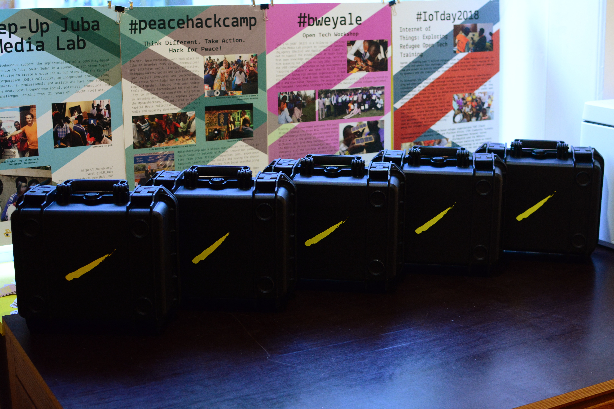

# Repair Kit

The Universal Repair Kit is a compact, modular, and robust toolkit designed to empower people to repair small devices, household appliances, and minor machinery. Its **open-source** design and clear organization make it an ideal solution for a wide range of use cases, from community initiatives to personal projects.

---

## Key Features

* **Modular Design**: The kit is built in a modular fashion, allowing for customization to fit various repair scenarios. The current version includes **basic equipment modules (plus a first aid kit), a soldering module, and a basic electronics module**. You can easily add new modules for specific needs.
* **Clear Organization**: Every tool has its place, making it easy to see which tools are missing at a glance.
* **Rugged and Mobile**: Built to withstand the demands of mobile use, the case is **shockproof, dustproof, and waterproof**.
* **Open Source**: The complete documentation for the kit's construction and contents is available here. You can build, modify, and improve upon the design to suit your own needs and create new modules for different use cases.

---

## Application Scenarios

The Urban Repair Kit is a versatile tool with many potential applications:

* **Repair Initiatives**: for local repair initiatives, such as **Repair Cafés**, providing a mobile and well-organized toolset for on-site repairs
* **Mobile Events**: use the kit for demonstrations or actual repairs at events, workshops, or public gatherings
* **Lending Programs**: for lending to individuals or organizations through initiatives, such as repair cafés, public libraries, or maker spaces
* **Education and Training**: excellent resource for teaching repair skills in schools, community colleges, or adult education programs
* **Personal Use**: A comprehensive and well-organized toolkit for anyone who wants a solid repair foundation at home

---

## Production Steps

The current production process for the kit:

* Ordering all required items.
* Laser-cutting the cardboard layers.
* Unpacking and checking all items.
* Preparing special items (e.g., cutting hook-and-loop fasteners and rubber bands; cutting and putting together heat shrink tubes; cutting sandpaper).
* Picking items using the provided pick-list (in `BOM.fods`).
* Printing and cutting the photos of the tools.
* Preparing the workspace, including 3D-printing the gluing and stacking tool.
* Gluing the layers together.
* Final assembly and packing.
* Documenting feedback in the issue list.

---

## Related Projects & Documentation

This project originated from the universal modules concept of the **#ASKotec** project, designed for non-urban use in Africa. The documentation for the predecessor version is available on the [ASKotec GitHub](https://github.com/opencultureagency/ASKotec).

Source files for other training modules and kits can be found via [ASKotec-Modules](https://github.com/opencultureagency/ASKotec-Modules).

---

## Credits

The initial design for this new Repair Kit approach was supported by [repami.de](https://repami.de), a network for quality repairs in Berlin.

**Detailed license notes will follow.**

### Repository Structure

* `assets/`: Add additional files and images here.
* `src/`: Add new source files here.
* `prod/`: For production files (without images, etc.).
* Create new folders here if needed, following the dir-std standard.
