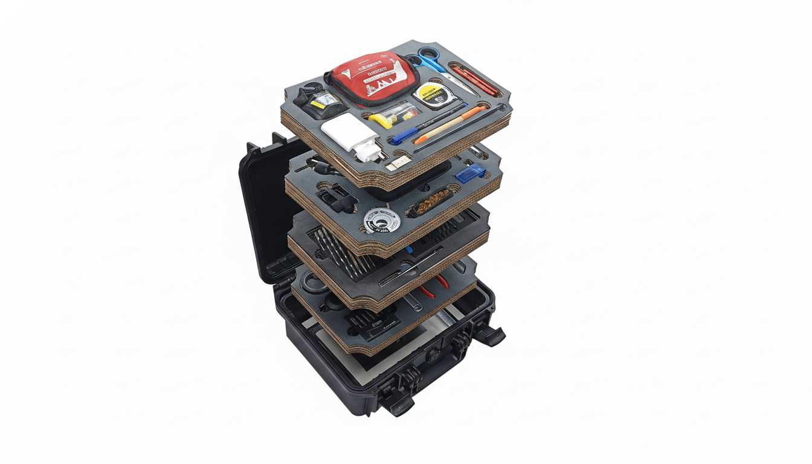
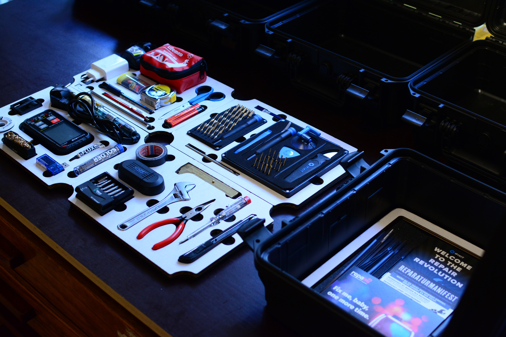
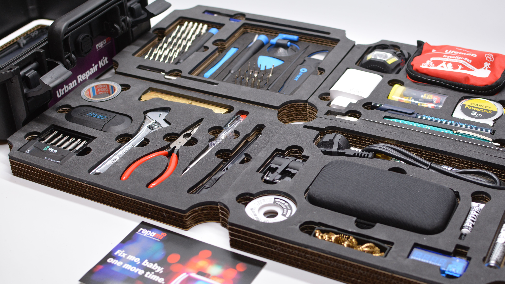
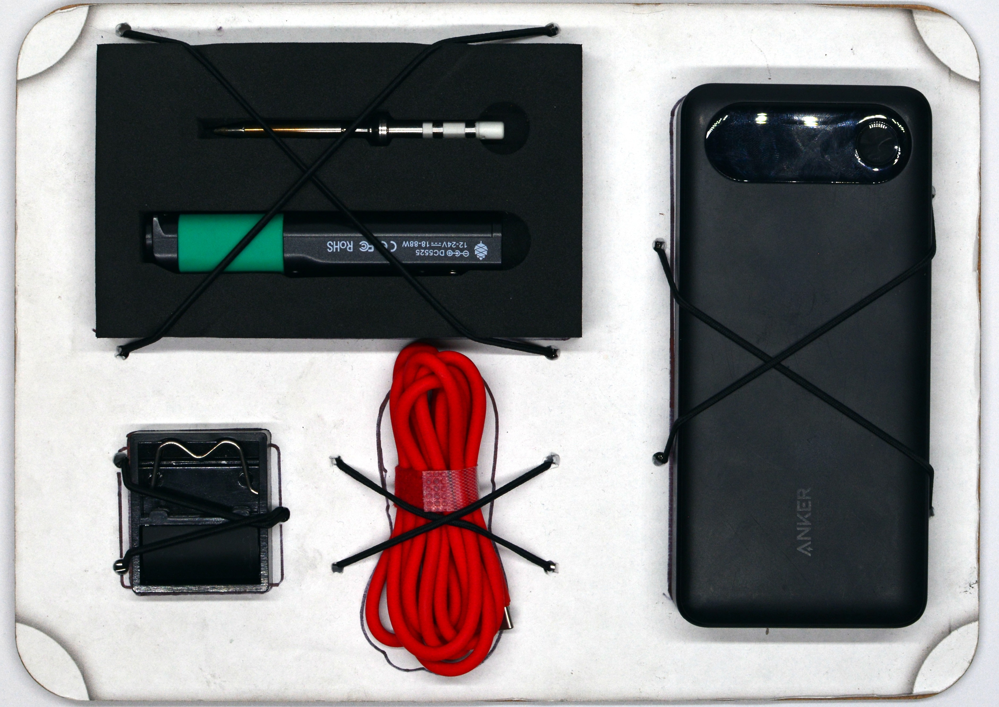
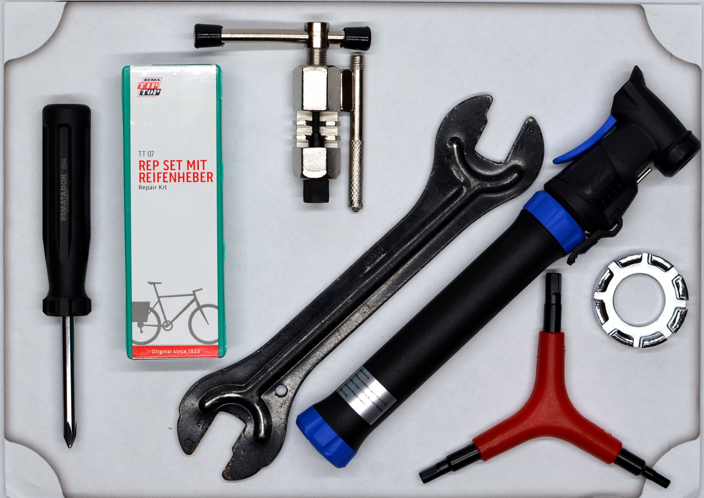
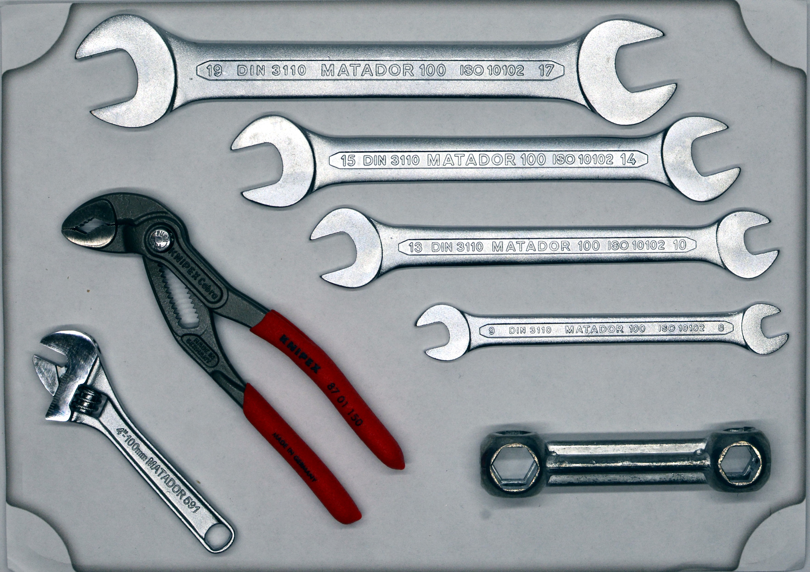

# Repair Kit

[[**README auf Deutsch**](/README_DE.md)]



The Universal Repair Kit is a compact, modular, and robust toolkit approach designed to empower people in repair initiatives to repair small devices, electronic & household appliances, and minor machinery. Its **open-source** design and modular organisation make it an ideal solution for a wide range of use cases, from community collaboration to educational or personal projects.

Website: <https://askotec.openculture.agency/Repair-Kit>

## Key Features

* **Modular Design**: The kit is built in a modular fashion, allowing for customisation to fit various repair scenarios. The current version includes **basic equipment modules, for most relevant [application scenarios](#application-scenarios)**. You can easily add new modules for specific needs.
* **Clear Organisation**: Every tool has its place, making it easy to see which tools are missing at a first look.
* **Rugged and Mobile**: In combination with a solid case - built to withstand the demands of mobile use, the case is **shockproof, dustproof, and waterproof**.
* **Open Source**: The complete documentation for the kit's construction and contents is available here. You can [build](/prod/), [modify](/src/), and [improve](https://github.com/opencultureagency/Repair-Kit/issues) upon the design to suit your own needs and create new modules for different use cases and [case studies](#case-studies).



## Application Scenarios

The originally called **"Urban Repair Kit"** is a first variation as versatile tool with many potential applications:

* **Repair Initiatives**: for local repair initiatives, such as **Repair Cafés**, providing a mobile and well-organised toolset for on-site repairs. Startup initiatives especially
* **Mobile Events**: use the kit for demonstrations or actual repairs at events, workshops, or public gatherings
* **Lending Programs**: for lending to individuals or organisations through initiatives, such as repair cafés, public libraries, or maker spaces
* **Education and Training**: excellent resource for teaching repair skills in schools, community colleges, or adult education programs. (feel free [to suggest any features/materials](https://github.com/opencultureagency/Repair-Kit/issues/new) needed for that educational purpose)
* **Personal Use**: A comprehensive and well-organized toolkit for anyone who wants a solid repair foundation at home, DIY and adaptation possible due to its **open source** collaborative nature
* `you name it` - add your application scenario via [ticket](https://github.com/opencultureagency/Repair-Kit/issues/new)

## Modules included
- Module 1 ([repair-m01](docs/repair-m01.md)): Essentials
- Module 2 ([repair-m02](docs/repair-m02.md)): Soldering
- Module 3 ([repair-m03](docs/repair-m03.md)): Mobile Devices
- Module 4 ([repair-m04](docs/repair-m04.md)): Basic Tools
- Extras ([repair-extras](docs/repair-extras.md)): Extras - packing & additional material 



In the future there are other modules planned as this modular approach is inspired by the [#ASKotec-Modules](https://github.com/opencultureagency/ASKotec-Modules) and repair specific examples are available in the repository:

|Module 05   `draft`   | Module 06   `draft`  | Module 07  `draft`   | Module XX   |
|     ---       |     ---       |     ---       |     ---       |
| repair-m05 "Mobile Soldering"    | repair-m06 "Bike Basics"   | repair-m07 "Wrenches"   | `you name it` |
|            |              |              |     tbd       |


## Case Studies
### Commissioned Research: The "Urban Repair Kit" in Berlin City

In 2025 we started the first implementation in the context of an **"Urban Repair Kit"** for the German repair consortium **"repami"**: [BSR, BUND Berlin, Handwerkskammer Berlin, anstiftung](https://repami.de/kontakt).


The project outcome and evaluation will be shared after consolidation with the partners and finishing of the user feedback.

The documentation based on this case study is available in German language too, visit:

<https://askotec.openculture.agency/reparaturkit>

The Kit was produced five times and distributed to five initiatives/repair organisations for this purpose.

## Production Steps

The current production process for the kit:

* Ordering all required items.
* Laser-cutting the cardboard layers in the [/prod/](/prod/) folder.
* Unpacking and checking all items.
* Preparing special items (e.g., cutting hook-and-loop fasteners and rubber bands; cutting and putting together heat shrink tubes; cutting sandpaper).
* Picking items using the provided pick-list (in `BOM.fods`).
* Printing and cutting the photos of the tools.
* Preparing the workspace, including 3D-printing the gluing and stacking tool via `stl` [/prod/](/prod/). (For Bambulab P1S you can use the `gcode` provided example)
* Gluing the layers together. (be aware this take a lot of time, alternatively you can also skip the laser cut layer approach and use the grid system, visit [/src/CAD/README.md](/src/CAD/README.md))
* Final assembly and packing. (assembly documentation will follow)
* Documenting feedback in the issue list]().
* If you want to become case study partner you can either join [repami.de](https://repami.de/kontakt) in their current unit testing series in Berlin or request a separate project via [openculture.agency](https://openculture.agency).

## Dokumentation rendering

For rendering the documentation please refer to the [template.tex](/docs/template.tex) in order to generate a good PDF via pandoc (including the current Git Repository `version`):

make sure to navigate into the `/docs` folder an run the following command:

```bash
pandoc *.md --template=template.tex -V version="$(git describe --tags --always)" -o ../gen/Manual-EN.pdf
```

or if you want to generate the German DE version go into the `/docs/DE` directory and run:

```bash
pandoc *.md --template=../template.tex -V version="$(git describe --tags --always)" -o ../../gen/Manual-DE.pdf
```

## History

This Kit originated from the `ASKmod` and general concept of the **#ASKotec** (Access to Skills and Knowledge - open tech emergency case) Kit, designed for non-urban, rural use in Africa. The **open source** documentation for the predecessor version is available on the [#ASKotec GitHub](https://github.com/opencultureagency/ASKotec). You can find more information on the [Website](https://askotec.openculture.agency).

Source files for other training modules and kits can be found via [ASKotec-Modules](https://github.com/opencultureagency/ASKotec-Modules).


## Credits

The initial design for this new Repair Kit approach was supported by [repami.de](https://repami.de), a network for quality repairs in Berlin.

On all documentation we apply the [CC-BY-SA 4.0](/LICENSE_CC_BY-SA.md). Apart from that, on the technical files (in [/src/](/src/) and [/src/CAD](/src/CAD/) in specific) we apply the [CERN-OHL-W-2.0-or-later](/LICENSE_cern_ohl_w_v2.txt) for better integration (this also includes all production related exports to the [/prod/](/prod/) directory.). 

### Repository Structure

* `assets/`: Add additional files and images here. case studies, production, 
* `src/`: Add new source files here.
* `prod/`: For pure production files (exports, without embedded images, etc.).
  
> Create new folders here if needed, following the [osh-dir-std](https://gitlab.com/OSEGermany/osh-dir-std/) standard (we prefer `unixish` at root level for now).
