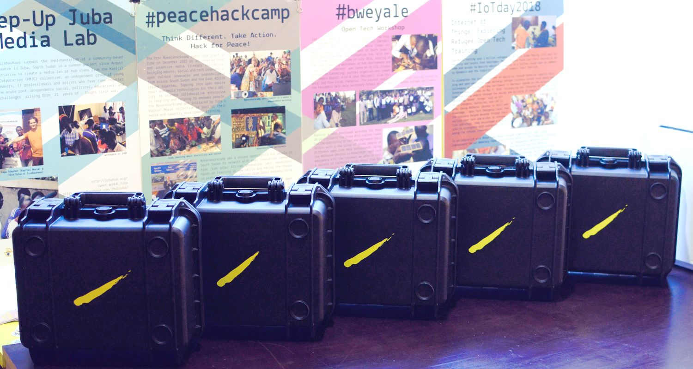

Absolutely! Here’s a full German translation of your README.md while keeping the formatting, links, and technical terminology intact:

---

# Reparatur-Kit



Das **Universelle Reparatur-Kit** ist ein kompaktes, modulares und robustes Werkzeug-Set, das Menschen in Reparaturinitiativen befähigen soll, kleine Geräte, elektronische & Haushaltsgeräte sowie kleinere Maschinen zu reparieren. Sein **Open-Source**-Design und die modulare Organisation machen es zu einer idealen Lösung für eine Vielzahl von Anwendungsfällen, von gemeinschaftlicher Zusammenarbeit bis hin zu persönlichen Projekten.

Website: [https://askotec.openculture.agency/Repair-Kit](https://askotec.openculture.agency/Repair-Kit)

## Hauptmerkmale

* **Modulares Design**: Das Kit ist modular aufgebaut, wodurch es sich an unterschiedliche Reparaturszenarien anpassen lässt. Die aktuelle Version enthält **Basisausstattungs-Module für die wichtigsten [Anwendungsszenarien](#anwendungsszenarien)**. Neue Module für spezielle Anforderungen können einfach hinzugefügt werden.
* **Klare Organisation**: Jedes Werkzeug hat seinen festen Platz, sodass auf den ersten Blick ersichtlich ist, welche Werkzeuge fehlen.
* **Robust und mobil**: In Kombination mit einem stabilen Koffer – gebaut für die Anforderungen mobiler Nutzung – ist der Koffer **stoßfest, staubdicht und wasserdicht**.
* **Open Source**: Die vollständige Dokumentation für Aufbau und Inhalt des Kits ist hier verfügbar. Du kannst das Design [bauen](/prod/), [modifizieren](/src/) und [verbessern](https://github.com/opencultureagency/Repair-Kit/issues), um es an deine Bedürfnisse anzupassen, neue Module für verschiedene Anwendungsfälle zu erstellen und [Fallstudien](#fallstudien) zu entwickeln.


## Anwendungsszenarien

Das **Urban Repair Kit** ist eine erste Variante als vielseitiges Werkzeug mit vielen potenziellen Anwendungen:

* **Reparaturinitiativen**: Für lokale Reparaturinitiativen wie **Repair Cafés**, um ein mobiles und gut organisiertes Werkzeugset für Vor-Ort-Reparaturen bereitzustellen.
* **Mobile Veranstaltungen**: Nutzung des Kits für Demonstrationen oder tatsächliche Reparaturen bei Events, Workshops oder öffentlichen Veranstaltungen.
* **Leihprogramme**: Zum Verleih an Einzelpersonen oder Organisationen über Initiativen wie Repair Cafés, öffentliche Bibliotheken oder Makerspaces.
* **Bildung und Ausbildung**: Hervorragendes Hilfsmittel zum Lehren von Reparaturfähigkeiten in Schulen, Volkshochschulen oder Erwachsenenbildungsprogrammen. (Vorschläge für zusätzliche [Features/Materialien](https://github.com/opencultureagency/Repair-Kit/issues/new) für den Bildungszweck sind willkommen.)
* **Privatnutzung**: Ein umfassendes und gut organisiertes Werkzeugset für alle, die eine solide Reparaturgrundlage zu Hause wünschen; DIY und Anpassungen sind dank der **Open-Source**-Natur möglich.
* `you name it` – füge dein Anwendungsszenario über ein [Ticket](https://github.com/opencultureagency/Repair-Kit/issues/new) hinzu.

## Enthaltene Module

* Modul 1 ([repair-m01](docs/DE/repair-m01.md)): Essentials
* Modul 2 ([repair-m02](docs/DE/repair-m02.md)): Löten
* Modul 3 ([repair-m03](docs/DE/repair-m03.md)): Mobile Geräte
* Modul 4 ([repair-m04](docs/DE/repair-m04.md)): Basiswerkzeuge
* Extras ([repair-extras](docs/DE/repair-extras.md)): Zusätzliche Materialien & Verpackung


Weitere Module sind zukünftig geplant, da der modulare Ansatz von den [#ASKotec-Modulen](https://github.com/opencultureagency/ASKotec-Modules) inspiriert ist. Reparaturspezifische Beispiele sind im Repository verfügbar:

| Modul 05   `Entwurf`             | Modul 06   `Entwurf`             | Modul 07  `Entwurf`              | Modul XX      |
|----------------------------------|----------------------------------|----------------------------------|---------------|
| repair-m05                       | repair-m06                       | repair-m07                       | `you name it` |
|  |  |  | tbd           |

## Fallstudien

### Auftraggeber: Urban Repair Kit in Berlin

2025 starteten wir die erste Umsetzung im Kontext des **„Urban Repair Kit“** für das deutsche Reparaturkonsortium **„repami“**: [BSR, BUND Berlin, Handwerkskammer Berlin, anstiftung](https://repami.de/kontakt).


Die Projektergebnisse und Evaluationen werden nach Abschluss der Konsolidierung mit den Partnern und Fertigstellung des Nutzerfeedbacks veröffentlicht.

Die Dokumentation basierend auf dieser Fallstudie wird bald auch in deutscher Sprache verfügbar sein.

## Produktionsschritte

Aktueller Produktionsprozess für das Kit:

* Alle benötigten Materialien bestellen.
* Laserschneiden der Kartonschichten im [/prod/](/prod/) Ordner.
* Auspacken und Prüfen aller Materialien.
* Vorbereitung spezieller Materialien (z. B. Schneiden von Klettbändern und Gummibändern; Zuschneiden und Zusammenfügen von Schrumpfschläuchen; Zuschneiden von Schleifpapier).
* Entnahme der Materialien anhand der bereitgestellten Pickliste (`BOM.fods`).
* Drucken und Zuschneiden der Werkzeugfotos.
* Arbeitsplatz vorbereiten, einschließlich 3D-Druck des Klebe- und Stapelwerkzeugs via `stl` [/prod/](/prod/). (Für Bambulab P1S kann das bereitgestellte `gcode`-Beispiel genutzt werden.)
* Schichten zusammenkleben. (Beachte: Dies dauert sehr lange. Alternativ kann die Laserschnitt-Methode übersprungen und das Gittersystem verwendet werden, siehe [/src/CAD/README.md](/src/CAD/README.md))
* Endmontage und Verpackung. (Montagedokumentation folgt)
* Feedback in der Issues-Liste dokumentieren.
* Wer Fallstudienpartner werden möchte, kann entweder [repami.de](https://repami.de/kontakt) in der aktuellen Testserie in Berlin beitreten oder ein separates Projekt über [openculture.agency](https://openculture.agency) anfragen.

## Dokumentation Rendering

Für die Erstellung der Dokumentation bitte die [template.tex](/docs/template.tex) verwenden, um ein PDF via pandoc zu generieren (inklusive der aktuellen Git Repository `version`):

Wechsle in den `/docs`-Ordner und führe folgenden Befehl aus:

```bash
pandoc *.md --template=template.tex -V version="$(git describe --tags --always)" -o ../gen/Manual-EN.pdf
```

Für die deutsche Version (`DE`) ins `/docs/DE` Verzeichnis wechseln und ausführen:

```bash
pandoc *.md --template=template.tex -V version="$(git describe --tags --always)" -o ../../gen/Manual-DE.pdf
```

## Historie

Dieses Kit stammt von der `ASKmod` Idee und dem allgemeinen Konzept des **#ASKotec** (Access to Skills and Knowledge – Open Tech Emergency Case) Kits, das für nicht-städtische, ländliche Nutzung in Afrika entwickelt wurde. Die **Open-Source**-Dokumentation der Vorgängerversion ist auf [#ASKotec GitHub](https://github.com/opencultureagency/ASKotec) verfügbar. Weitere Informationen gibt es auf der [Website](https://askotec.openculture.agency).

Quell-Dateien für weitere Trainingsmodule und Kits sind über [ASKotec-Modules](https://github.com/opencultureagency/ASKotec-Modules) verfügbar.

## Credits

Das initiale Design für diesen neuen Reparatur-Kit-Ansatz wurde unterstützt von [repami.de](https://repami.de), einem Netzwerk für Qualitätsreparaturen in Berlin.

Für die gesamte Dokumentation gilt [CC-BY-SA 4.0](/LICENSE_CC_BY-SA.md). Technische Dateien in [/src/](/src/) und [/src/CAD](/src/CAD/) unterliegen speziell [CERN-OHL-W-2.0-or-later](/LICENSE_cern_ohl_w_v2.txt) für bessere Integration (einschließlich aller produktionsbezogenen Exporte in das [/prod/](/prod/) Verzeichnis).

### Repository-Struktur

* `assets/`: Zusätzliche Dateien und Bilder, Fallstudien, Produktion etc.
* `src/`: Neue Quell-Dateien hier hinzufügen.
* `prod/`: Produktionsdateien (Exporte ohne eingebettete Bilder etc.).

> Neue Ordner bei Bedarf erstellen, nach dem [osh-dir-std](https://gitlab.com/OSEGermany/osh-dir-std/) Standard (wir bevorzugen aktuell `unixish` auf Root-Ebene).


