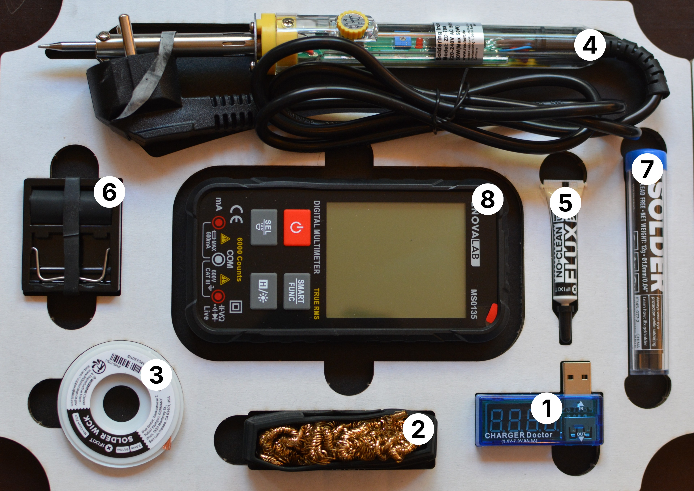

# Löten (repair-m02)

1. USB Voltmeter (USB-A)
1. Lötspitzenreiniger
1. Entlötlitze
1. Lötkolben (variable Temperatur)
1. Löt-Flussmittel
1. Lötkolben-Halter inkl. Set verschiedener Schrumpfschlauchstücke
1. Lötzinn
1. Multimeter inkl Handbuch
