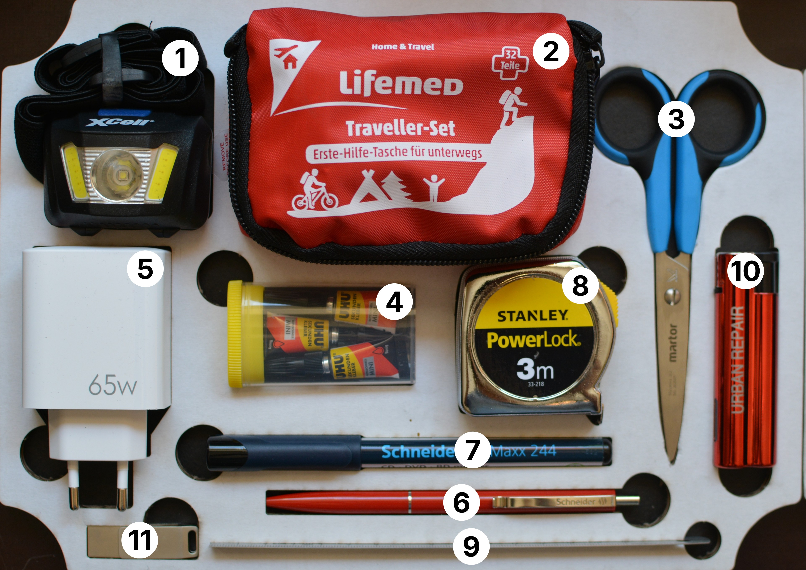

# Essentials (repair-m01)

1. Headlight (3 light settings, includes 3 AAA batteries)
1. First aid kit (with burn ointment gel)
1. Scissors
1. 3× Small tubes of super glue
1. USB power adaptor (USB-A and USB-C)
1. Pen
1. Waterproof permanent marker
1. Measuring tape (3m)
1. Metal ruler (15cm)
1. Windproof lighter
1. USB stick (USB-A and USB-C)

