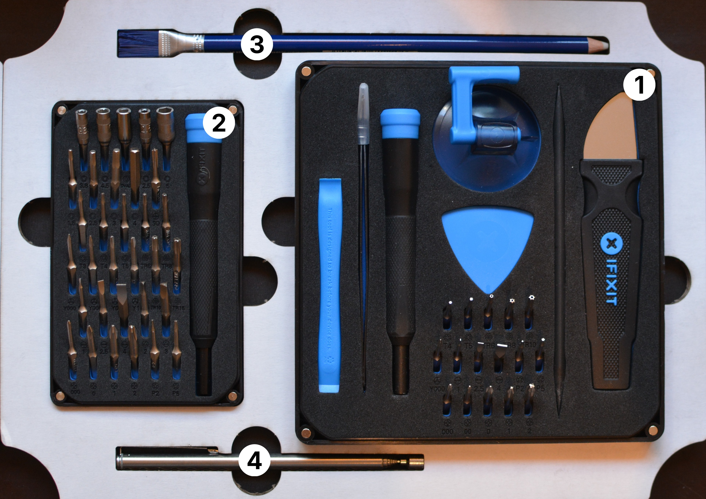

# Mobile Devices (repair-m03)

**Summary:**

> This Module is a special set dedicated for mobile devices repair, such as laptops, smartphones and other electronic devices in specific. It features the amazing iFixit repair kits as well as some hand-picked additions.

1. Essential Electronics Toolkit from iFixit 
   
   > – more info: <https://www.ifixit.com/products/essential-electronics-toolkit>
2. Extended Bit Set from iFixit 
   
   > – more info: <https://www.ifixit.com/products/moray-driver-kit>
4. Brush + Eraser (for cleaning)
5. Telescopic magnet (for lost metal parts)
