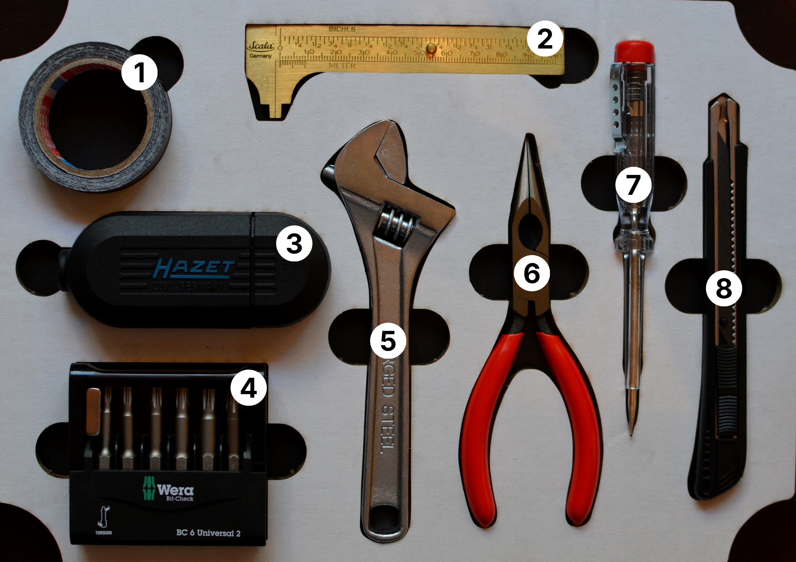

# Basic Tools (repair-m04)

1. Mini duct tape
1. Mini caliper 
1. Combination screwdriver handle with bit set (extension, socket: ¼″)
1. 2× Bit set (Torx bits, socket: ¼″, and a magnet for magnetized screwdriving)
1. Adjustable wrench
1. Pointed pliers
1. Screwdriver power tester
1. Cutter

