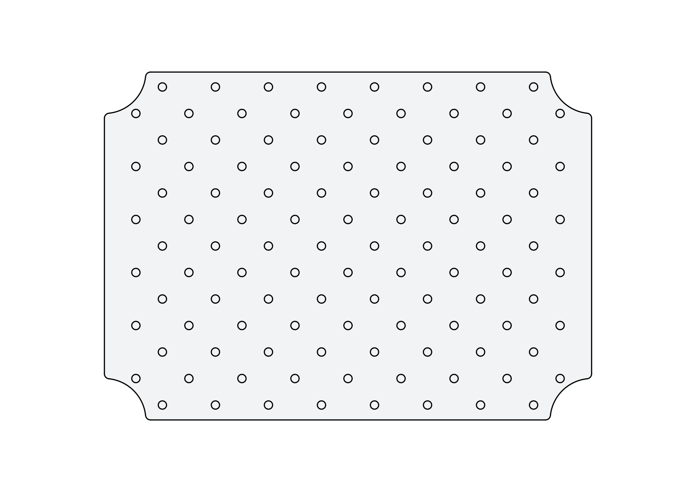

# CAD Documentation

> All Files related to CAD Design and digital supported [manufacturing](../../prod/) of the Kits
>
> Currently all CAD Files refer to packaging.

## Base Plate

**Optimized Base Grid 32mm x 32mm + 16mm Offset**

> 5mm Boring Holes  
>
> Base Grid: 6x9 (x32mm) +16mm = 208x288mm (close to DIN A4)
>
> Extra Grid: 6x8 (x32mm) with 16mm Offset
>
> New: Inner Corner Radius (similar to Shadowboard layers)
>
> [SVG](../prod/32-grid-Base-Plate+16mm_2D_Export_A4__.svg), [DXF](../prod/32-grid-Base-Plate+16mm_2D_Export_A4__.dxf) for manufacturing are available and for editing [FreeCAD](../CAD/Grid-Base-Plate/32-grid-Base-Plate+16mm.FCStd)

## Base Pin

> Currently not used in the main manufacturing

A simple 3D printable pin for a defined distance between base plates. Requires an empty bore hole and a M3.5x12mm (can be longer) screw with countersunk head.

At least 3 per Layer needed, defined by the highest item on the layer. [FreeCAD](CAD/Pin/Base-Pin.FCStd) Source Files can be edited to a hight needed. 

